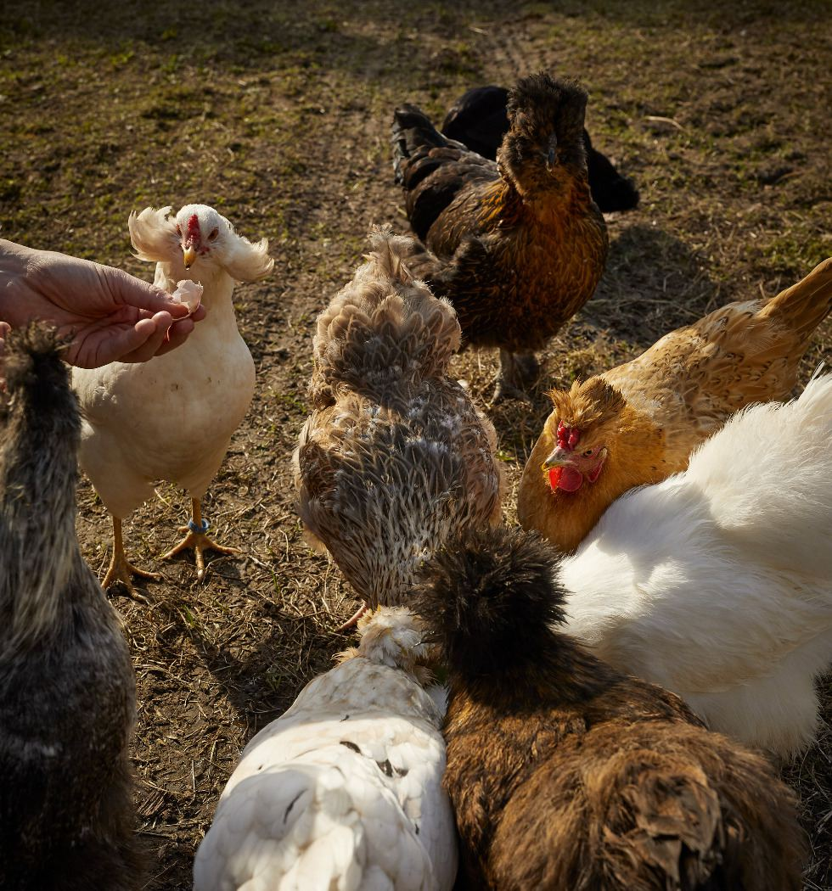
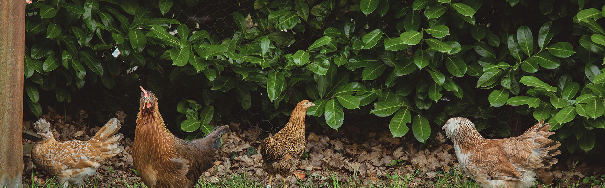

# Mise à jour : Equipe plus grande !
## Expansion d'équipe
Expandez votre équipe, obtenez de nouveaux slots de poules!
Vous commencez maintenant avec 1 slot, et vous pouvez en obtenir jusqu'à 4! Mais l'amélioration niveau 4 est onéreuse...

## Nouvelle ressources
💎 Pierre précieuse : Obtenez la parfois en minant... Bonne chance pour la trouver !
Utilisez les pour augmenter vos emplacements de poules et d'artéfacts!
*Des rumeurs disent que ces pierres seront utilisées pour autre chose dans le futur...*

## Autres améliorations
- La fréquence d'apparition des cadeaux ne dépendra plus du nombre de poules équipées.
- L'ouverture de boites x100 est possible à partir du niveau 10.
- Les niveaux max de poules sont recalculés et bien affichés sur les détails de poules.

Merci à tous les testeurs/euses pour vos retours!!

*À venir : interface compatible télephone*